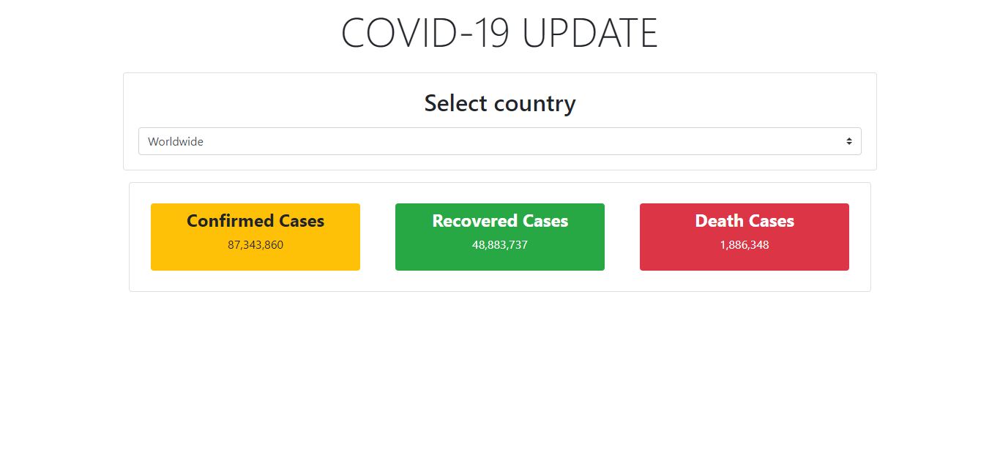
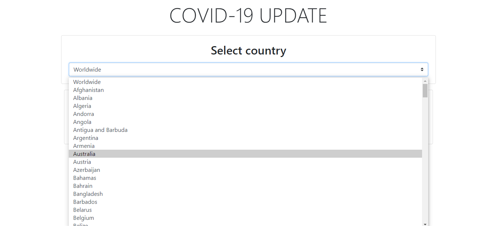

# COVID-19 Cases Tracker

## Description

- A [ReactJS](https://github.com/facebook/create-react-app) project that uses [Axios](https://github.com/axios/axios) for performing HTTP requests and [Mathdroid COVID-19](https://github.com/mathdroid/covid-19-api) for API to track confirmed, recovered, and death cases of COVID-19 worldwide.
- Selecting a country will only get the cases on that country.

## Quick view

## Quick Start

In the project directory, you can run:

### `npm install`

This will install all the dependencies.

### `npm start`

Runs the app in the development mode.
Open [http://localhost:3000](http://localhost:3000) to view it in the browser.

The page will reload if you make edits.
You will also see any errors in the console.